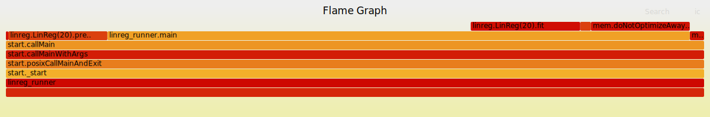
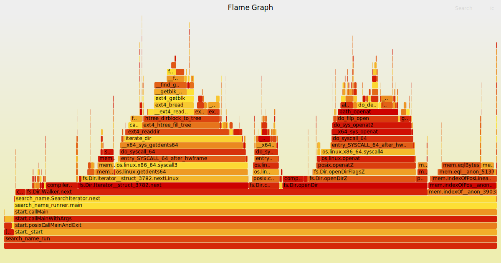
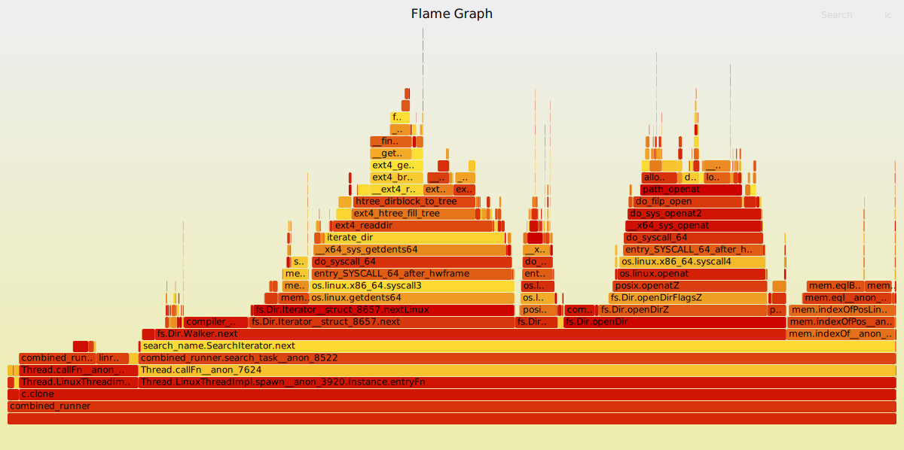
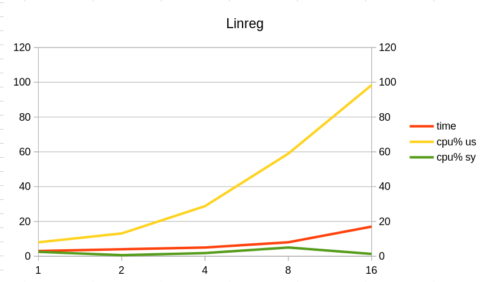
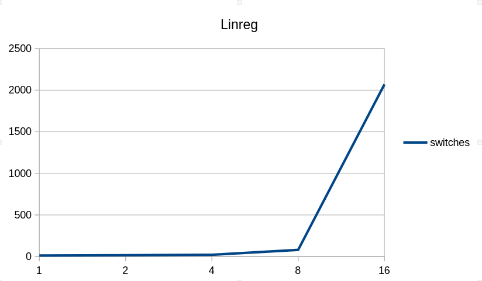
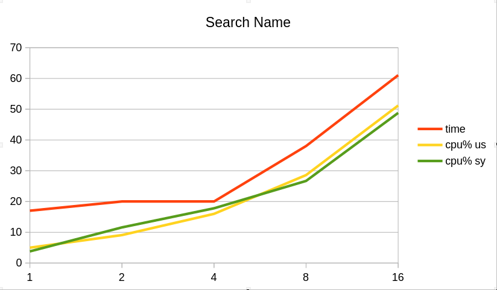
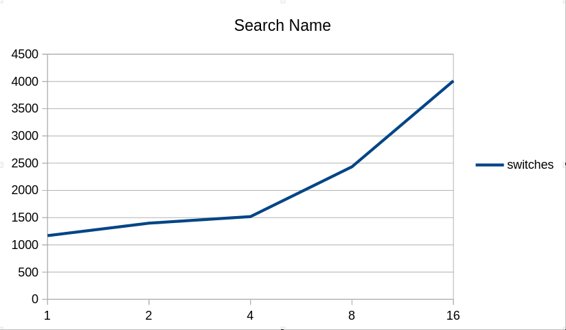
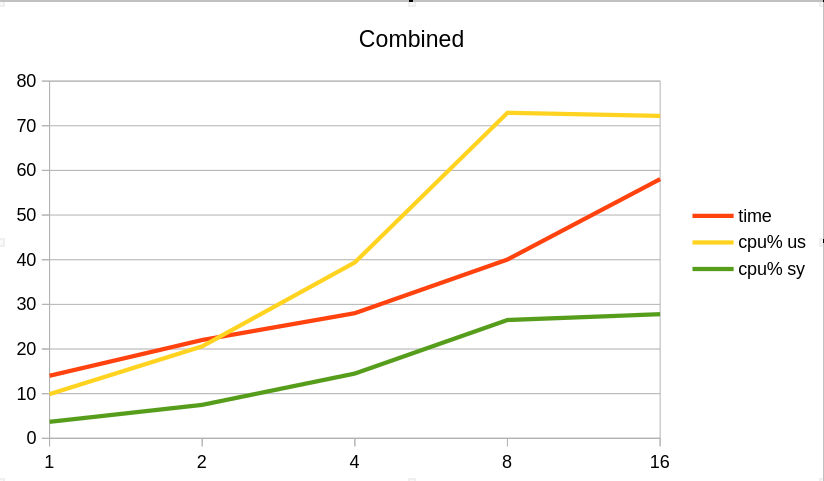
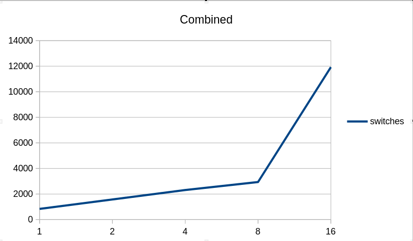

https://docs.google.com/spreadsheets/d/1uS79h2Ffm8lQNEBO4soRk7nOdIO0Ht9xBrH5RLXpOkc/edit?gid=1225901641#gid=1225901641

# Лабораторная работа №1

Бутвин Михаил P3330

Linux fork
search-name: Поиск файла в файловой системе по имени
linreg: Построение модели линейной регрессии

---

# Часть 1. Запуск программ

Необходимо реализовать собственную оболочку командной строки - shell. Выбор ОС для реализации производится на усмотрение студента. Shell должен предоставлять пользователю возможность запускать программы на компьютере с переданными аргументами командной строки и после завершения программы показывать реальное время ее работы (подсчитать самостоятельно как «время завершения» – «время запуска»).

## Исходный код

[Исходный код оболочки коммандной строки](./shell/shell.zig)

## Пример работы

```
>> A=10 python -c "import os; print(os.environ)"
environ({'PYENV_HOOK_PATH': '/home/butvinm/.pyenv/pyenv.d:/usr/share/pyenv/pyenv.d:/usr/etc/pyenv.d:/usr/local/etc/pyenv.d:/etc/pyenv.d:/usr/lib/pyenv/hooks', 'PYENV_VERSION': 'system', 'PWD': '/home/butvinm/Dev/itmo-os/lab0', 'A': '10', 'PYENV_DIR': '/home/butvinm/Dev/itmo-os/lab0', 'SHLVL': '0', 'PYENV_ROOT': '/home/butvinm/.pyenv', 'PATH': '/usr/share/pyenv/libexec:/usr/share/pyenv/plugins/python-build/bin:/usr/local/sbin:/usr/local/bin:/usr/bin', 'LC_CTYPE': 'C.UTF-8'})
Process 381622 exited with status code 0 in 0.084395227 seconds
>> exit
Bye!
```

# Часть 2. Мониторинг и профилирование

Разработать комплекс программ-нагрузчиков по варианту, заданному преподавателем. Каждый нагрузчик должен, как минимум, принимать параметр, который определяет количество повторений для алгоритма, указанного в задании. Программы должны нагружать вычислительную систему, дисковую подсистему или обе подсистемы сразу. Необходимо скомпилировать их без опций оптимизации компилятора.

Перед запуском нагрузчика, попробуйте оценить время работы вашей программы или ее результаты (если по варианту вам досталось измерение чего либо). Постарайтесь обосновать свои предположения. Предположение можно сделать, основываясь на свой опыт, знания ОС и характеристики используемого аппаратного обеспечения.

1.  Запустите программу-нагрузчик и зафиксируйте метрики ее работы с помощью инструментов для профилирования. Сравните полученные результаты с ожидаемыми. Постарайтесь найти объяснение наблюдаемому.
2.  Определите количество нагрузчиков, которое эффективно нагружает все ядра процессора на вашей системе. Как распределяются времена  USER%, SYS%, WAIT%, а также реальное время выполнения нагрузчика, какое количество переключений контекста (вынужденных и невынужденных) происходит при этом?
3.  Увеличьте количество нагрузчиков вдвое, втрое, вчетверо. Как изменились времена, указанные на предыдущем шаге? Как ведет себя ваша система?
4.  Объедините программы-нагрузчики в одну, реализованную при помощи потоков выполнения, чтобы один нагрузчик эффективно нагружал все ядра вашей системы. Как изменились времена для того же объема вычислений? Запустите одну, две, три таких программы.
5.  Добавьте опции агрессивной оптимизации для компилятора. Как изменились времена? На сколько сократилось реальное время исполнения программы нагрузчика?

## Анализ

### linreg

linreg не содержит IO операций, вычисления сводятся к простому перемножению и сложению векторов. Эти операции могут быть реализованы при помощи SSE инструкций, что еще сильнее ускорит программу. Сложность обучения `O(VECTOR_SIZE)`, а вычисление нового результата `O(1)`. Тогда программа, обучающаяся на векторе из десятка элементов и предугадывающая несколько значений займет всего пару сотен циклов процессора, что примерно равно `300 / 3.1Gz = 6.451e-08 с`, а на выполнение 100000000 обучений уйдет порядка 9.6 секунд

### search-name

Поиска файлов требует большого количества системных вызовов и операций чтения. Операции чтения с большой вероятностью будут закешированы. Сравнение имен файлов будет также нагружать процессор. Точно вычислить нельзя, но предполагаю, что поиск среди десятка тысяч файлов должен укладываться в секунду.

## Результаты профилирования

### Ltrace и strace

Программы слинкованы статически, поэтому вызова внешних библиотек нет.

strace подтверждает предположение о количестве обращениий к систменым вызовам.

**linreg:**

```
% time     seconds  usecs/call     calls    errors syscall
------ ----------- ----------- --------- --------- ----------------
  0.00    0.000000           0         5           rt_sigaction
  0.00    0.000000           0         1           execve
  0.00    0.000000           0         1           arch_prctl
  0.00    0.000000           0         1           prlimit64
------ ----------- ----------- --------- --------- ----------------
100.00    0.000000           0         8           total
```

**search-name:**

```
% time     seconds  usecs/call     calls    errors syscall
------ ----------- ----------- --------- --------- ----------------
 51.43   14.721754           2   5199000           getdents64
 28.81    8.247494           3   2539000           openat
 19.71    5.642384           2   2538000           close
  0.05    0.012889           6      2000           mmap
  0.01    0.002337           2      1000           lseek
  0.00    0.000000           0         5           rt_sigaction
  0.00    0.000000           0         1           execve
  0.00    0.000000           0         1           arch_prctl
  0.00    0.000000           0         1           prlimit64
------ ----------- ----------- --------- --------- ----------------
100.00   28.626858           2  10279008           total
```

**combined:**

```
% time     seconds  usecs/call     calls    errors syscall
------ ----------- ----------- --------- --------- ----------------
100.00    7.380161      527154        14        12 futex
  0.00    0.000024          12         2           munmap
  0.00    0.000000           0         2           mmap
  0.00    0.000000           0         2           mprotect
  0.00    0.000000           0         5           rt_sigaction
  0.00    0.000000           0         2           clone
  0.00    0.000000           0         1           execve
  0.00    0.000000           0         1           arch_prctl
  0.00    0.000000           0         1           prlimit64
------ ----------- ----------- --------- --------- ----------------
100.00    7.380185      246006        30        12 total
```

### FlameGraph

```bash
$COMMAND & RUNNER_PID=$! && perf record -F 99 -g -o "$PROFILE_DATA_DIR/$RUNNER_NO.perf" --pid $RUNNER_PID

perf script -i "$PROFILE_DATA_DIR/$RUNNER_NO.perf" | ./FlameGraph/stackcollapse-perf.pl --inline --all | ./FlameGraph/flamegraph.pl > "$PROFILE_DATA_DIR/FlameGraph-$RUNNER_NO.svg"
```

**linreg:**



**search-name:**



**combined:**



### pidstat

```bash
$COMMAND & RUNNER_PID=$! && pidstat -p $RUNNER_PID 1 >> "$PROFILE_DATA_DIR/$RUNNER_NO.pidstat"
```

**linreg:**

```
Linux 6.6.74-1-MANJARO (butvinm-work) 	28/02/25 	_x86_64_	(16 CPU)

15:07:00      UID       PID    %usr %system  %guest   %wait    %CPU   CPU  Command
15:07:01     1000    398710  100.00    0.00    0.00    0.00  100.00     6  linreg_runner
15:07:02     1000    398710  100.00    0.00    0.00    0.00  100.00     0  linreg_runner
```

**search-name:**

```
Linux 6.6.74-1-MANJARO (butvinm-work) 	28/02/25 	_x86_64_	(16 CPU)

15:11:51      UID       PID    %usr %system  %guest   %wait    %CPU   CPU  Command
15:11:52     1000    401286   43.00   53.00    0.00    0.00   96.00     3  search_name_run
15:11:53     1000    401286   39.00   59.00    0.00    1.00   98.00     2  search_name_run
15:11:54     1000    401286   51.00   48.00    0.00    0.00   99.00     3  search_name_run
15:11:55     1000    401286   44.00   55.00    0.00    2.00   99.00     0  search_name_run
15:11:56     1000    401286   43.00   55.00    0.00    1.00   98.00     7  search_name_run
15:11:57     1000    401286   48.00   50.00    0.00    1.00   98.00     5  search_name_run
15:11:58     1000    401286   52.00   47.00    0.00    2.00   99.00     1  search_name_run
15:11:59     1000    401286   45.00   53.00    0.00    1.00   98.00    11  search_name_run
15:12:00     1000    401286   45.00   54.00    0.00    2.00   99.00     2  search_name_run
15:12:01     1000    401286   54.00   43.00    0.00    1.00   97.00     5  search_name_run
15:12:02     1000    401286   52.00   47.00    0.00    2.00   99.00     7  search_name_run
15:12:03     1000    401286   43.00   54.00    0.00    1.00   97.00     1  search_name_run
15:12:04     1000    401286   48.00   51.00    0.00    2.00   99.00     0  search_name_run
15:12:05     1000    401286   45.00   53.00    0.00    1.00   98.00     3  search_name_run
15:12:06     1000    401286   49.00   50.00    0.00    1.00   99.00     1  search_name_run
15:12:07     1000    401286   50.00   48.00    0.00    2.00   98.00     1  search_name_run
```

**combined:**
```
Linux 6.6.74-1-MANJARO (butvinm-work) 	28/02/25 	_x86_64_	(16 CPU)

15:06:28      UID       PID    %usr %system  %guest   %wait    %CPU   CPU  Command
15:06:29     1000    398569  146.00   51.00    0.00    0.00  197.00     8  combined_runner
15:06:30     1000    398569  156.00   42.00    0.00    0.00  198.00     8  combined_runner
15:06:31     1000    398569   84.00   45.00    0.00    0.00  129.00     8  combined_runner
15:06:32     1000    398569   51.00   43.00    0.00    0.00   94.00     8  combined_runner
15:06:33     1000    398569   49.00   48.00    0.00    0.00   97.00     8  combined_runner
15:06:34     1000    398569   50.00   46.00    0.00    0.00   96.00     8  combined_runner
15:06:35     1000    398569   52.00   45.00    0.00    0.00   97.00     8  combined_runner
15:06:36     1000    398569   56.00   42.00    0.00    0.00   98.00     8  combined_runner
15:06:37     1000    398569   47.00   50.00    0.00    0.00   97.00     8  combined_runner
15:06:38     1000    398569   53.00   45.00    0.00    0.00   98.00     8  combined_runner
15:06:39     1000    398569   51.00   47.00    0.00    0.00   98.00     8  combined_runne
```

### perf-stat

Из показателей perf-stat видно, что предполагаемое время исполнения оказалось близким к реальному - ошибка в разы, но не порядок.

```bash
$COMMAND & RUNNER_PID=$! && perf stat -d -e task-clock,context-switches,cache-misses,cache-references,instructions,cycles -o "$PROFILE_DATA_DIR/$RUNNER_NO.stat" --pid $RUNNER_PID
```

**linreg:**

```
# started on Fri Feb 28 14:40:11 2025


 Performance counter stats for process id '378972':

          3,025.84 msec task-clock                       #    0.756 CPUs utilized
                 7      context-switches                 #    2.313 /sec
     <not counted>      cpu_atom/cache-misses/                                                  (0.00%)
            14,082      cpu_core/cache-misses/           #   13.72% of all cache refs
     <not counted>      cpu_atom/cache-references/                                              (0.00%)
           102,628      cpu_core/cache-references/       #   33.917 K/sec
     <not counted>      cpu_atom/instructions/                                                  (0.00%)
    49,184,385,612      cpu_core/instructions/           #    5.20  insn per cycle
     <not counted>      cpu_atom/cycles/                                                        (0.00%)
     9,458,407,423      cpu_core/cycles/                 #    3.126 GHz
     <not counted>      cpu_atom/L1-dcache-loads/                                               (0.00%)
    13,971,365,770      cpu_core/L1-dcache-loads/        #    4.617 G/sec
            69,115      cpu_core/L1-dcache-load-misses/  #    0.00% of all L1-dcache accesses
     <not counted>      cpu_atom/LLC-loads/                                                     (0.00%)
            44,152      cpu_core/LLC-loads/              #   14.592 K/sec
     <not counted>      cpu_atom/LLC-load-misses/                                               (0.00%)
             1,241      cpu_core/LLC-load-misses/        #    2.81% of all LL-cache accesses

       4.004842306 seconds time elapsed
```

**search-name:**

```
# started on Fri Feb 28 14:44:47 2025


 Performance counter stats for process id '381133':

         15,724.51 msec task-clock                       #    0.982 CPUs utilized
             1,153      context-switches                 #   73.325 /sec
       124,329,937      cpu_atom/cache-misses/           #   68.26% of all cache refs           (1.49%)
       145,427,023      cpu_core/cache-misses/           #   65.13% of all cache refs           (98.51%)
       182,138,791      cpu_atom/cache-references/       #   11.583 M/sec                       (1.49%)
       223,292,894      cpu_core/cache-references/       #   14.200 M/sec                       (98.51%)
    43,591,268,115      cpu_atom/instructions/           #    1.26  insn per cycle              (1.49%)
    82,372,767,574      cpu_core/instructions/           #    1.90  insn per cycle              (98.51%)
    34,730,971,584      cpu_atom/cycles/                 #    2.209 GHz                         (1.49%)
    43,255,912,296      cpu_core/cycles/                 #    2.751 GHz                         (98.51%)
    12,391,288,080      cpu_atom/L1-dcache-loads/        #  788.024 M/sec                       (1.49%)
    21,427,209,153      cpu_core/L1-dcache-loads/        #    1.363 G/sec                       (98.51%)
       501,665,851      cpu_core/L1-dcache-load-misses/  #    2.34% of all L1-dcache accesses   (98.51%)
        18,277,433      cpu_atom/LLC-loads/              #    1.162 M/sec                       (1.49%)
        33,945,137      cpu_core/LLC-loads/              #    2.159 M/sec                       (98.51%)
               134      cpu_atom/LLC-load-misses/        #    0.00% of all LL-cache accesses    (1.49%)
        17,143,817      cpu_core/LLC-load-misses/        #   50.50% of all LL-cache accesses    (98.51%)

      16.017570372 seconds time elapsed
```

**combined:**

```
# started on Fri Feb 28 14:48:08 2025

 Performance counter stats for process id '383957':

         21,448.19 msec task-clock                       #    1.128 CPUs utilized
             1,456      context-switches                 #   67.885 /sec
       126,496,006      cpu_atom/cache-misses/           #   71.72% of all cache refs           (2.15%)
       165,182,957      cpu_core/cache-misses/           #   71.48% of all cache refs           (97.85%)
       176,381,207      cpu_atom/cache-references/       #    8.224 M/sec                       (2.15%)
       231,089,756      cpu_core/cache-references/       #   10.774 M/sec                       (97.85%)
    61,250,366,763      cpu_atom/instructions/           #    1.49  insn per cycle              (2.15%)
   117,346,766,298      cpu_core/instructions/           #    2.31  insn per cycle              (97.85%)
    41,156,123,371      cpu_atom/cycles/                 #    1.919 GHz                         (2.15%)
    50,755,395,315      cpu_core/cycles/                 #    2.366 GHz                         (97.85%)
    18,161,585,216      cpu_atom/L1-dcache-loads/        #  846.766 M/sec                       (2.15%)
    32,600,242,337      cpu_core/L1-dcache-loads/        #    1.520 G/sec                       (97.85%)
       495,935,328      cpu_core/L1-dcache-load-misses/  #    1.52% of all L1-dcache accesses   (97.85%)
        18,824,903      cpu_atom/LLC-loads/              #  877.692 K/sec                       (2.15%)
        33,562,129      cpu_core/LLC-loads/              #    1.565 M/sec                       (97.85%)
               157      cpu_atom/LLC-load-misses/        #    0.00% of all LL-cache accesses    (2.15%)
        20,685,167      cpu_core/LLC-load-misses/        #   61.63% of all LL-cache accesses    (97.85%)

      19.020107258 seconds time elapsed
```

### Сравнение Debug и Release сборок

| Нагрузчик   | time debug | time release |
| ----------- | ---------- | ------------ |
| linreg      | 4.0048     | 1.001        |
| search-name | 16.017     | 8.007        |
| combined    | 19.020     | 11.011       |

### Графики

| linreg                                     |                                      |
| ------------------------------------------ | ------------------------------------ |
|  |  |

| search-name                                     |                                           |
| ----------------------------------------------- | ----------------------------------------- |
|  |  |

| combined                                     |                                        |
| -------------------------------------------- | -------------------------------------- |
|  |  |
