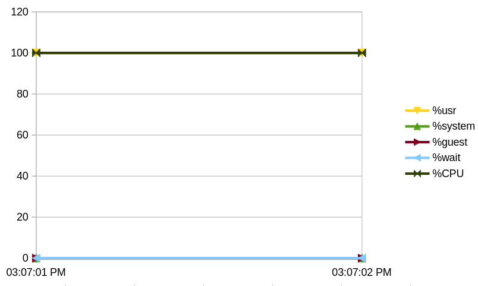
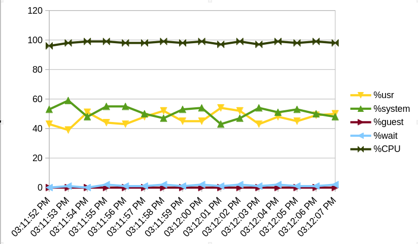
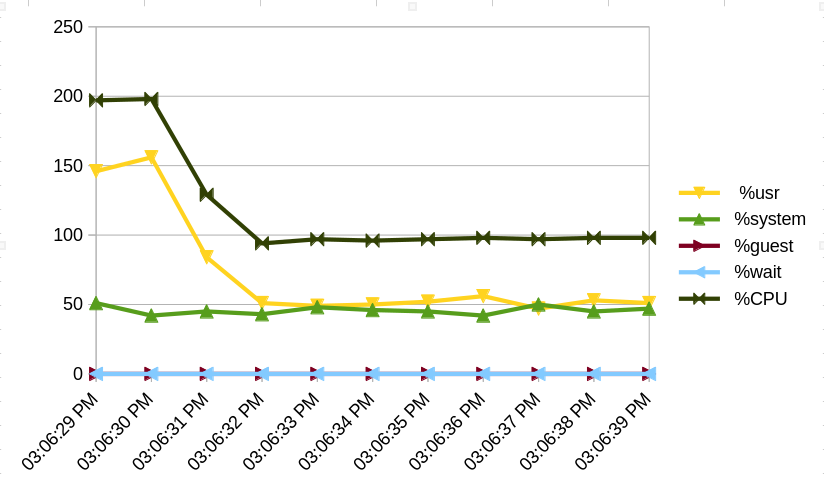

https://docs.google.com/spreadsheets/d/1uS79h2Ffm8lQNEBO4soRk7nOdIO0Ht9xBrH5RLXpOkc/edit?gid=1225901641#gid=1225901641

# Лабораторная работа №1

Бутвин Михаил P3330

Linux fork
search-name: Поиск файла в файловой системе по имени
linreg: Построение модели линейной регрессии

---

# Часть 1. Запуск программ

Необходимо реализовать собственную оболочку командной строки - shell. Выбор ОС для реализации производится на усмотрение студента. Shell должен предоставлять пользователю возможность запускать программы на компьютере с переданными аргументами командной строки и после завершения программы показывать реальное время ее работы (подсчитать самостоятельно как «время завершения» – «время запуска»).

## Исходный код

[Исходный код оболочки коммандной строки](./shell/shell.zig)

## Пример работы

```
>> A=10 python -c "import os; print(os.environ)"
environ({'PYENV_HOOK_PATH': '/home/butvinm/.pyenv/pyenv.d:/usr/share/pyenv/pyenv.d:/usr/etc/pyenv.d:/usr/local/etc/pyenv.d:/etc/pyenv.d:/usr/lib/pyenv/hooks', 'PYENV_VERSION': 'system', 'PWD': '/home/butvinm/Dev/itmo-os/lab0', 'A': '10', 'PYENV_DIR': '/home/butvinm/Dev/itmo-os/lab0', 'SHLVL': '0', 'PYENV_ROOT': '/home/butvinm/.pyenv', 'PATH': '/usr/share/pyenv/libexec:/usr/share/pyenv/plugins/python-build/bin:/usr/local/sbin:/usr/local/bin:/usr/bin', 'LC_CTYPE': 'C.UTF-8'})
Process 381622 exited with status code 0 in 0.084395227 seconds
>> exit
Bye!
```

# Часть 2. Мониторинг и профилирование

Разработать комплекс программ-нагрузчиков по варианту, заданному преподавателем. Каждый нагрузчик должен, как минимум, принимать параметр, который определяет количество повторений для алгоритма, указанного в задании. Программы должны нагружать вычислительную систему, дисковую подсистему или обе подсистемы сразу. Необходимо скомпилировать их без опций оптимизации компилятора.

Перед запуском нагрузчика, попробуйте оценить время работы вашей программы или ее результаты (если по варианту вам досталось измерение чего либо). Постарайтесь обосновать свои предположения. Предположение можно сделать, основываясь на свой опыт, знания ОС и характеристики используемого аппаратного обеспечения.

1.  Запустите программу-нагрузчик и зафиксируйте метрики ее работы с помощью инструментов для профилирования. Сравните полученные результаты с ожидаемыми. Постарайтесь найти объяснение наблюдаемому.
2.  Определите количество нагрузчиков, которое эффективно нагружает все ядра процессора на вашей системе. Как распределяются времена  USER%, SYS%, WAIT%, а также реальное время выполнения нагрузчика, какое количество переключений контекста (вынужденных и невынужденных) происходит при этом?
3.  Увеличьте количество нагрузчиков вдвое, втрое, вчетверо. Как изменились времена, указанные на предыдущем шаге? Как ведет себя ваша система?
4.  Объедините программы-нагрузчики в одну, реализованную при помощи потоков выполнения, чтобы один нагрузчик эффективно нагружал все ядра вашей системы. Как изменились времена для того же объема вычислений? Запустите одну, две, три таких программы.
5.  Добавьте опции агрессивной оптимизации для компилятора. Как изменились времена? На сколько сократилось реальное время исполнения программы нагрузчика?

## Анализ

**linreg:**


linreg не содержит IO операций и системных вызовов, вычисления сводятся к простому перемножению и сложению векторов.
Эти операции могут быть реализованы при помощи SSE инструкций, что еще сильнее ускорит программу.
Сложность алгоритма обучения (fit) `O(VECTOR_SIZE)`, а прогноза (predict) `O(1)`.
Предположим, программа обучает 10000000 моделей для векторов из 20 элементов и выполняет 100 предсказаний для каждой модели. Вектора помещаются в регистры процессора.
Тогда будет выполнено примерно $10000000*20*A + 10000000*100*B + 10000000*C + 10000000*100*C$ операций, где A - 4 операции над векторами, B - операции сложения и умножения числа с плавающей точкой, а C - цикл.
Предполагая A=4, B=2 и С=2, частоту процессора 3.2Gz получим примерное время работы $(10000000*20*4 + 10000000*100*2 + 10000000*2 + 10000000*100*2) / 3.2*10^9 = 1.50625$ секунды.

**search-name:**

Поиск файлов требует большого количества системных вызовов для работы с файлами и операций чтения для получения их метаданных.
Сравнение имен файлов с заданным будет также нагружать процессор.
Пусть директория, в которой осуществляется поиск содержит 10000 файлов, поиск производится 1000 раз.
Тогда будет выполнено $1000*A + 1000*(10000*B + 10000*C)$ операций, где A=2 - цикл, B - время получения метаданных файла, а C - время сравнения названия файлов.
Метаданные файлов через несколько запусков скорее всего будут закешированы и храниться в оперативной памяти.
Доступ к оперативная память примерно в 10 раз медленнее операции процессора, а прочитать понадобится сотни байт. Системный вызов в сотни раз дольше одного такта процессора. Тогда оценим B как 2000.
Пусть длина строки для поиска 10 символов, каждое сравнение - чтение из памяти, тогда пусть C=100.
Получаем примерно $(1000*2 + 1000*(10000*2000 + 10000*100)) / 3.2*10^9 = 6.562$ секунд.

**combined:**

Одновременный запуск обоих алгоритмов в двух потоках займет время самого долгого из алгоритмов + небольшой оверхед от создания потоков. Получим чуть больше $6.562$ секунд, допустим, $7$ секунд.

## Результаты профилирования

### Ltrace и strace

Zig линкует программы статически, поэтому `ltrace` не дает никаких результатов. Можем убедиться в этом, проверив метаинформацию ELF файла:
```bash
$ file ./zig-out/bin/search_name_runner
./zig-out/bin/search_name_runner: ELF 64-bit LSB executable, x86-64, version 1 (SYSV), statically linked, with debug_info, not stripped
```

`strace` показало ожидаемый результат:
- **linreg** практически не используем системные вызовы
- **search-name** использует системные вызовы для работы с файлами (getdents64, openat, close, lseek)
- **combined** использует системные вызовы для работы с файлами из-за **search-name**, а также системные вызовы для создания и управления потоками (futex, clone, mprotect).

**linreg:**

```
% time     seconds  usecs/call     calls    errors syscall
------ ----------- ----------- --------- --------- ----------------
  0.00    0.000000           0         5           rt_sigaction
  0.00    0.000000           0         1           execve
  0.00    0.000000           0         1           arch_prctl
  0.00    0.000000           0         1           prlimit64
------ ----------- ----------- --------- --------- ----------------
100.00    0.000000           0         8           total
```

**search-name:**

```
% time     seconds  usecs/call     calls    errors syscall
------ ----------- ----------- --------- --------- ----------------
 51.43   14.721754           2   5199000           getdents64
 28.81    8.247494           3   2539000           openat
 19.71    5.642384           2   2538000           close
  0.05    0.012889           6      2000           mmap
  0.01    0.002337           2      1000           lseek
  0.00    0.000000           0         5           rt_sigaction
  0.00    0.000000           0         1           execve
  0.00    0.000000           0         1           arch_prctl
  0.00    0.000000           0         1           prlimit64
------ ----------- ----------- --------- --------- ----------------
100.00   28.626858           2  10279008           total
```

**combined:**

```
% time     seconds  usecs/call     calls    errors syscall
------ ----------- ----------- --------- --------- ----------------
100.00    7.380161      527154        14        12 futex
  0.00    0.000024          12         2           munmap
  0.00    0.000000           0         2           mmap
  0.00    0.000000           0         2           mprotect
  0.00    0.000000           0         5           rt_sigaction
  0.00    0.000000           0         2           clone
  0.00    0.000000           0         1           execve
  0.00    0.000000           0         1           arch_prctl
  0.00    0.000000           0         1           prlimit64
------ ----------- ----------- --------- --------- ----------------
100.00    7.380185      246006        30        12 total
```

### FlameGraph

```bash
$COMMAND & RUNNER_PID=$! && perf record -F 99 -g -o "$PROFILE_DATA_DIR/$RUNNER_NO.perf" --pid $RUNNER_PID

perf script -i "$PROFILE_DATA_DIR/$RUNNER_NO.perf" | ./FlameGraph/stackcollapse-perf.pl --inline --all | ./FlameGraph/flamegraph.pl > "$PROFILE_DATA_DIR/FlameGraph-$RUNNER_NO.svg"
```

**linreg:**


**search-name:**


**combined:**


### pidstat

```bash
$COMMAND & RUNNER_PID=$! && pidstat -p $RUNNER_PID 1 >> "$PROFILE_DATA_DIR/$RUNNER_NO.pidstat"
```

**linreg:**



**search-name:**



**combined:**



### perf-stat

```bash
$COMMAND & RUNNER_PID=$! && perf stat -e task-clock,context-switches,cache-misses,cache-references,instructions,cycles -o "$PROFILE_DATA_DIR/$RUNNER_NO.stat" --pid $RUNNER_PID
```

**linreg:**

```
# started on Fri Feb 28 14:40:11 2025


 Performance counter stats for process id '378972':

          3,025.84 msec task-clock                       #    0.756 CPUs utilized
                 7      context-switches                 #    2.313 /sec
     <not counted>      cpu_atom/cache-misses/                                                  (0.00%)
            14,082      cpu_core/cache-misses/           #   13.72% of all cache refs
     <not counted>      cpu_atom/cache-references/                                              (0.00%)
           102,628      cpu_core/cache-references/       #   33.917 K/sec
     <not counted>      cpu_atom/instructions/                                                  (0.00%)
    49,184,385,612      cpu_core/instructions/           #    5.20  insn per cycle
     <not counted>      cpu_atom/cycles/                                                        (0.00%)
     9,458,407,423      cpu_core/cycles/                 #    3.126 GHz

       4.004842306 seconds time elapsed
```

**search-name:**

```
# started on Fri Feb 28 14:44:47 2025


 Performance counter stats for process id '381133':

         15,724.51 msec task-clock                       #    0.982 CPUs utilized
             1,153      context-switches                 #   73.325 /sec
       124,329,937      cpu_atom/cache-misses/           #   68.26% of all cache refs           (1.49%)
       145,427,023      cpu_core/cache-misses/           #   65.13% of all cache refs           (98.51%)
       182,138,791      cpu_atom/cache-references/       #   11.583 M/sec                       (1.49%)
       223,292,894      cpu_core/cache-references/       #   14.200 M/sec                       (98.51%)
    43,591,268,115      cpu_atom/instructions/           #    1.26  insn per cycle              (1.49%)
    82,372,767,574      cpu_core/instructions/           #    1.90  insn per cycle              (98.51%)
    34,730,971,584      cpu_atom/cycles/                 #    2.209 GHz                         (1.49%)
    43,255,912,296      cpu_core/cycles/                 #    2.751 GHz                         (98.51%)

      16.017570372 seconds time elapsed
```

**combined:**

```
# started on Fri Feb 28 14:48:08 2025

 Performance counter stats for process id '383957':

         21,448.19 msec task-clock                       #    1.128 CPUs utilized
             1,456      context-switches                 #   67.885 /sec
       126,496,006      cpu_atom/cache-misses/           #   71.72% of all cache refs           (2.15%)
       165,182,957      cpu_core/cache-misses/           #   71.48% of all cache refs           (97.85%)
       176,381,207      cpu_atom/cache-references/       #    8.224 M/sec                       (2.15%)
       231,089,756      cpu_core/cache-references/       #   10.774 M/sec                       (97.85%)
    61,250,366,763      cpu_atom/instructions/           #    1.49  insn per cycle              (2.15%)
   117,346,766,298      cpu_core/instructions/           #    2.31  insn per cycle              (97.85%)
    41,156,123,371      cpu_atom/cycles/                 #    1.919 GHz                         (2.15%)
    50,755,395,315      cpu_core/cycles/                 #    2.366 GHz                         (97.85%)

      19.020107258 seconds time elapsed
```

### Сравнение времени работы Debug и Release сборок, а также предполагаемого времени

| Нагрузчик   | time debug | time release | time expected |
| ----------- | ---------- | ------------ | ------------- |
| linreg      | 4.005      | 1.001        | 1.506         |
| search-name | 16.017     | 8.007        | 6.562         |
| combined    | 19.020     | 11.011       | 7.000         |


### Зависимость показателей от количества нагрузчиков

| linreg                                     |                                      |
| ------------------------------------------ | ------------------------------------ |
|  |  |

| search-name                                     |                                           |
| ----------------------------------------------- | ----------------------------------------- |
|  |  |

| combined                                     |                                        |
| -------------------------------------------- | -------------------------------------- |
|  |  |
